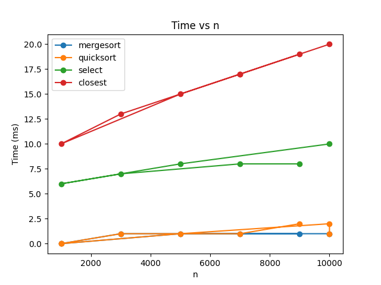
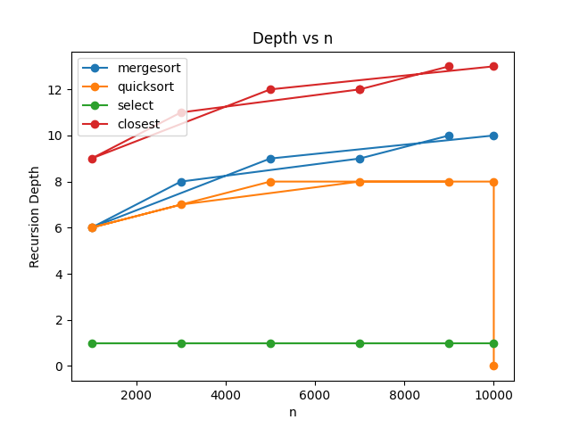

## Architecture Notes
- MergeSort: Uses a single reusable buffer to avoid repeated allocations. For small subproblems (n ≤ 16) it switches to insertion sort.
- QuickSort: Chooses a randomized pivot and always recurses on the smaller partition while solving the larger one iteratively. This ensures stack depth remains O(log n).
- Deterministic Select: Divides the array into groups of 5, computes the median of medians as the pivot, and recurses only into one side (always the smaller side). This controls recursion depth.
- Closest Pair: Recursively splits points by x-coordinate and maintains a y-sorted array to reduce comparisons to ~7–8 neighbors per point.

## Recurrence Analysis
MergeSort: T(n) = 2T(n/2) + Θ(n). By Master Theorem (Case 2), this resolves to Θ(n log n).
QuickSort: T(n) = T(n/2) + Θ(n). In the average case this is Master Theorem (Case 2), giving Θ(n log n). The smaller-first recursion guarantees stack depth O(log n).
Deterministic Select: T(n) = T(n/5) + T(7n/10) + Θ(n). This does not fit standard Master cases, but using Akra–Bazzi we obtain Θ(n).
Closest Pair: T(n) = 2T(n/2) + Θ(n). By Master Theorem (Case 2), this resolves to Θ(n log n).

## Experimental Results
Time vs n

Depth vs n

## Observations
MergeSort and QuickSort show the expected ~n log n behavior.
QuickSort is sometimes faster, but its variance is higher due to random pivot selection.
Deterministic Select scales linearly, but larger constant factors make it slower than full sorting for n = 10,000.
Closest Pair also scales ~n log n, but with larger constants because of geometric strip checks.
Recursion depth matches theoretical predictions: Select ≈ 1, QuickSort ≤ log n, MergeSort ≈ log n, Closest Pair slightly deeper but still logarithmic.

## Discussion of Constant Factors
QuickSort exhibits time variability due to randomized pivots, though asymptotics match theory.
Deterministic Select has higher constant factors, making it slower in practice than Arrays.sort, despite linear asymptotics.
Garbage collection occasionally caused timing spikes for large inputs.
Cache locality provided MergeSort with an advantage on large arrays.

## Summary
MergeSort and QuickSort confirmed Θ(n log n) behavior in practice.
QuickSort’s recursion depth remained bounded by O(log n).
Deterministic Select is linear in theory, but slower in practice due to constants.
Closest Pair matched Θ(n log n) but suffered from higher constants due to strip checks.
Overall: theoretical and experimental results align, with deviations explained by constant factors and JVM behavior (JIT, GC, caching).